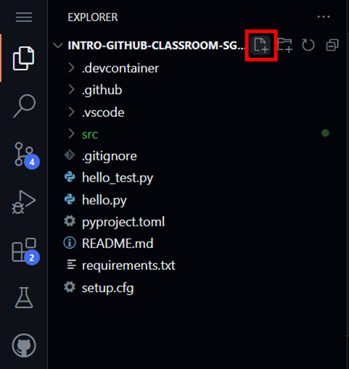

# Intro to GitHub Classroom
This example project is written in Python, and tested with [pytest](https://www.python.org/).

## The assignment

The tests in [`python_refresher_test.py`](python_refresher_test.py) are failing right now. After making the appropriate changes, you can check to see if your changes are correct by running the `pytest` command in the terminal. If the tests are green, you're good to go! If not, you'll need to read the error messages, make some changes, and run the tests again.

> NOTE: To create a new file in Codespaces, click the "New File.." icon in the file explorer to the left and type the name of the file you want to create. Then, press Enter.

### 📥 Import Statements

Import statements are used to include external Python modules or libraries in a script, making their functions, classes, and variables available for use. Create a Python script named `import_example.py` that imports the `math` module and prints the value of π (pi) to the terminal using the `math.pi` constant.

### 🔠 Variables and Data Types

Variables are named locations used to store data, and data types define the kind of data a variable can hold, such as integers, strings, lists, and dictionaries. Create a Python script named `variables_data_types.py` that defines a variable `age` with an integer value of `25` and a variable `name` with a string value of `"John"`. Print each of these with Python's built-in `print` function (e.g., `print(age, name)`).

### 🧩 Functions and Methods

Functions are reusable blocks of code that perform a specific task, and methods are similar to functions but are associated with object instances or classes. Create a Python script named `functions_methods.py` that defines a function `greet` which takes a name as an argument and prints "Hello, [name]!" where `[name]` is the argument passed to the function. Call this function with the name `"Alice"`.

### 🛑 Control Flow Statements

Control flow statements, such as if-else and loops (for, while), control the execution order of code based on conditions or repeated execution. Create a Python script named `control_flow.py` that checks if a variable `number` is greater than `10`. If so, it prints "Greater than 10", otherwise "10 or less". Use `number = 8` for this example.

### 🗂️ Lists and Dictionaries

Lists are ordered collections of items, and dictionaries are collections of key-value pairs, both of which are used to store and manage data in Python. Create a Python script named `lists_dictionaries.py` that defines a list named `colors` with the values `"red"`, `"green"`, and `"blue"`, and a dictionary named `person` with keys `"name"` and `"age"` with values `"Alice"` and `30`, respectively. Print the first color in the list and the person's name from the dictionary.

### 📦 Modules and Packages

Modules are individual Python files containing reusable code, and packages are collections of modules organized in directories. Create a Python script named `modules_packages.py` that imports the datetime module, uses the `today` function from the `datetime.date` module to get today's date, and prints it in the default format "YYYY-MM-DD".

### 👥 Classes and Objects
 
Classes are blueprints for creating objects (instances), defining the properties and behaviors that the objects encapsulate. Create a Python script named `classes_objects.py` that defines a `Car` class with a method `honk` that prints `"Beep!"`. Then, create an instance of `Car` named `my_car` and call its `honk` method.

### 📁 File Handling

File handling involves reading from and writing to files, allowing data to be saved or retrieved from persistent storage. Create a Python script named `file_handling.py` that writes `"Hello, World!"` to a file named `hello.txt` and then reads the content from this file and prints it to the terminal.

### ⚠️ Error and Exception Handling

Error and exception handling involves capturing and responding to errors or exceptional conditions that occur during program execution. Create a Python script named `error_handling.py` that tries to open a file named `nonexistent.txt` for reading and catches the `FileNotFoundError`, printing "File not found." if the file does not exist.

### ✍️ String Formatting

String formatting involves creating strings by embedding expressions or variables within them, often using techniques like f-strings for readability and conciseness. Create a Python script named `string_formatting.py` that defines two variables, `fruit` with the value `"apple"` and `count` with the value `5`. Print a message using f-string formatting: "There are 5 apples."

## Autograding (GitHub Actions)

As a reminder, to trigger autograding through GitHub Actions, open the "Source Control" button on the left sidebar, write a commit message, and commit and push your changes to GitHub.

After committing and pushing your changes, the autograder will run your tests and give you a grade. First, ensure you're signed into GitHub (you will be prompted with a dialogue box). To check your autograded scores, click on the GitHub Actions extension on the left sidebar, click the refresh button at the top-right corner of the sidebar, hover over the latest workflow run, and click the globe icon 🌐. Next, click the "Autograding" job button, click the dropdown for the "Run education/autograding" step, and scroll down to see your grade.

If the GitHub Actions extension isn't working (e.g., `data provider not available`), navigate to your GitHub assignment repository directly, click on the `Actions` tab, and click on the latest workflow run. The link will be of the form `https://github.com/ACC-HelloWorld/4-hardware-software-communication-GITHUB_USERNAME`, where `GITHUB_USERNAME` is replaced with your own. For example, if your GitHub username is `sgbaird`, the link would be `https://github.com/ACC-HelloWorld/4-hardware-software-communication-sgbaird`. If you have trouble finding it, you can also use the "find a repository" search bar (boxed in red in the image below) on your [GitHub homepage](https://github.com) after signing in.

▶️ If you get stuck, refer to [the walkthrough video](https://github.com/AC-Classroom/intro-github-classroom/assets/45469701/93760bf7-0d27-49dc-8f66-7d50d428677f).